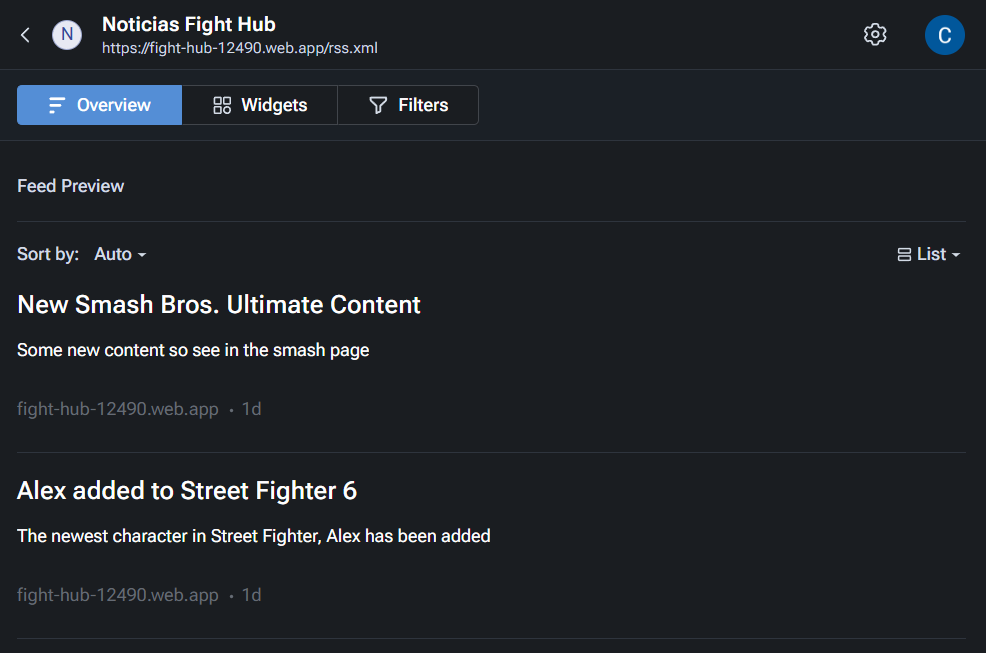
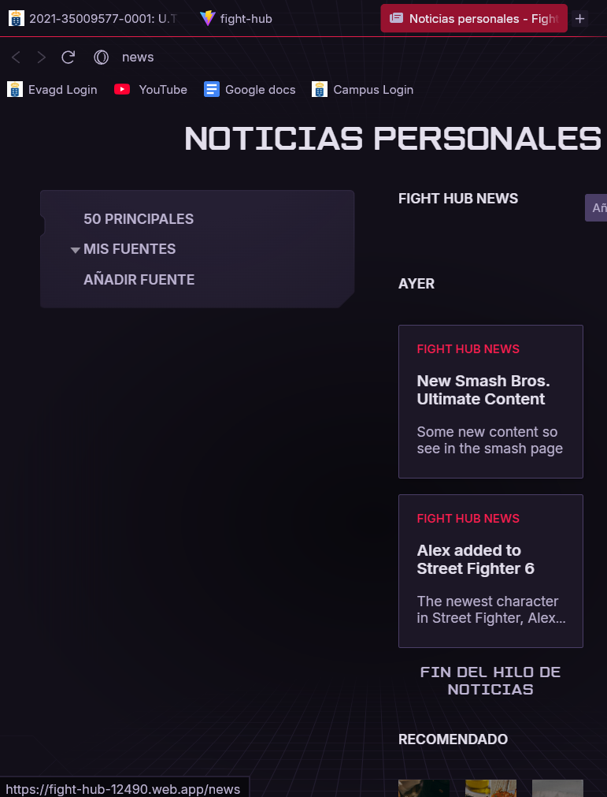

# Fight Hub

Fight Hub is a web about fighting games, where we show information about the game itself, its mechanics, characters and more.
Here's a link of our page hosted via Firebase Hosting: 
https://fight-hub-12490.web.app

## About the Project

This project is part of a 2 year course of Multiplattform App Development, this project is mostly focused on learning how to use and create a web using React, a Javascript library.

## Features

The main features of Fight Hub are the implemented Chat feature, where you can chat with other users about different games having game-specific chats to look for someone to play; our game pages where you can see a quick description of a game, its characters and mechanics; and the ability to create a user for Fight Hub (This is needed to use the chat feature).

## Built With

- React
- Javascript
- Html
- Css

## Third Party Components

- React Router
- Leaflet
- Firebase (Firestore & Hosting)

Links (in order of display):

- https://reactrouter.com
- https://leafletjs.com
- https://firebase.google.com

## Future Improvments

For the future Fight Hub is thought of to add even more games and more characters some may be requested via our chat. Also adding other features thought of by the community, feel free to give your ideas for optimization or new features!

## Tutorials

In this section there will be links of some tutorials used in the project:

README: https://github.com/othneildrew/Best-README-Template

## Rss feed img

## Import examples

Download files with data to try and import (in the News page)

- [JSON](./data-examples/news-example-datos.json)
- [CSV](./data-examples/news-example-datos.csv)
- [XML](./data-examples/news-example-datos.xml)
- [Excel](./data-examples/news-example-datos.xlsx)
- [ODS](./data-examples/news-example-datos.ods)